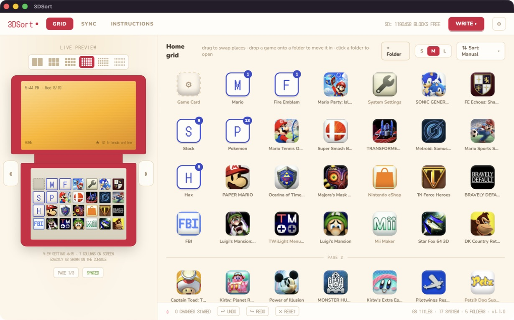
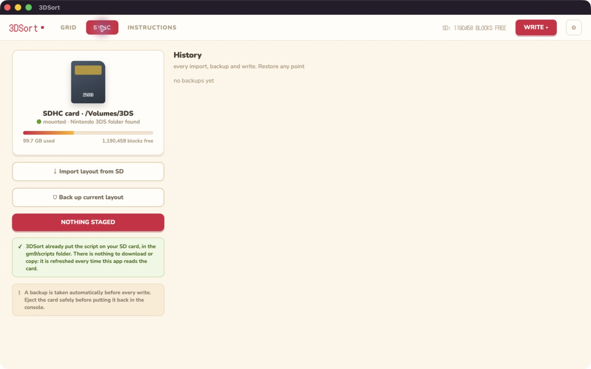
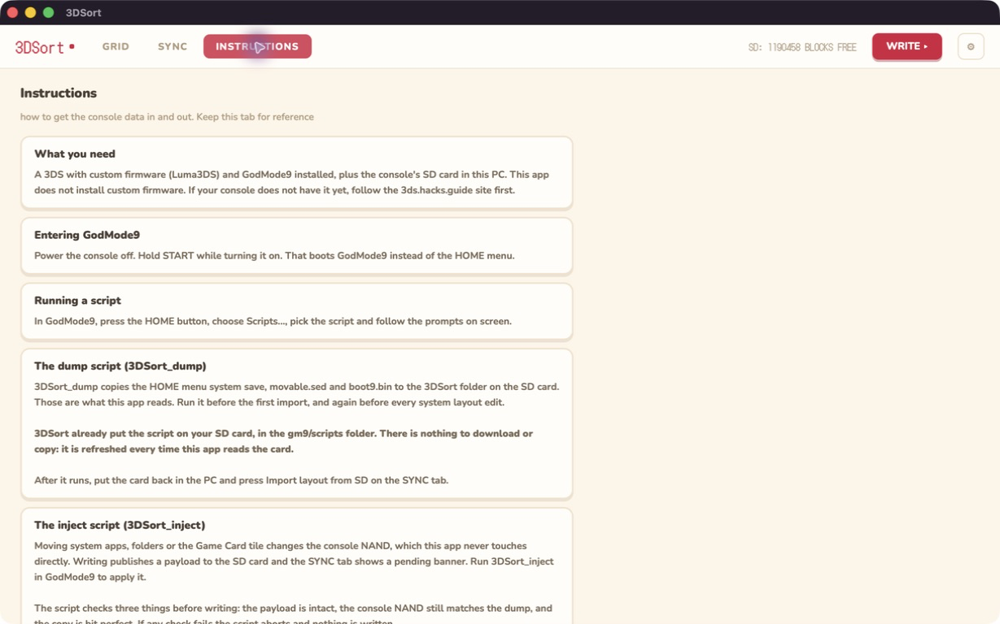

<div align="center">


# 3DSort

**Rearrange your Nintendo 3DS HOME menu from your PC.**

[](#running-from-source)
[](#running-from-source)
[](#tests)
[](#macos-fork-validation)
[](LICENSE)
[](#status)

</div>

> [!NOTE]
> **Built with multiple AI assistants.** The upstream project openly credits
> Claude. This macOS arm64 fork was then implemented, debugged, packaged and
> hardware-read-tested with OpenAI Codex. The useful comparison is not a slogan:
> this branch adds a native helper, a real `.app` bundle, a safe mock launcher,
> a macOS packaging test, a GodMode9 script fix, and a documented real-card
> validation record. The evidence is below.

Organizing icons on the console itself is slow: one stylus drag at a time, page
by page. 3DSort edits the layout directly on the SD card instead. Put the card
in your computer, sort your games automatically by alphabetical order or release year, or manually drag things around and manage folders in a desktop app, check the live preview,
then write the result back and boot the console.

**[Download the latest release](https://github.com/SalustianCreativeLabs/3DSort/releases/latest)**
— a `.zip` with a single portable `.exe` for Windows, no installer and no Python needed.


> [!IMPORTANT]
> Every write takes an automatic backup first, and nothing touches the card
> until you confirm. When you move system apps or folders, do not boot the HOME
> menu between writing on the PC and running the inject script on the console.

## What it does

- Swap any two tiles by dropping one onto the other: games, system apps,
  folder tiles, even the Game Card slot
- Move games and system apps in and out of folders
- Create, rename, empty and delete folders
- Sort presets (A to Z, Z to A, release date oldest or newest first)
- Live preview that reproduces the console screen exactly, for every view
  setting from 1x60 to 6x10
- Every change is staged in memory first, with undo, redo and reset. Nothing
  touches the card until you hit WRITE and confirm
- A backup of the current layout is taken automatically before every write,
  and any backup can be restored later
- Every write also unwraps gift-boxed icons in bulk (same mechanism as
  Cthulhu's "Unwrap all") and preserves the HOME menu theme you picked on the
  console, even when restoring an old backup

## Writing and backups


Moving system apps and folders needs one extra step, because their layout
lives in a NAND system save rather than on the card: dump it once with the
generated `3DSort_dump` GodMode9 script, edit freely on the PC, then run
`3DSort_inject` in GodMode9 after writing. The inject script verifies every
copy with SHA-256 gates and fixes the save CMAC, and it aborts rather than
write anything inconsistent. Without that dump, system apps simply stay
pinned and everything else keeps working.

One rule keeps that cycle smooth: do not boot the HOME menu between writing
and injecting. Every HOME boot touches the NAND save, so the inject script
will refuse a stale target. If it happens, run `3DSort_dump` again and retry;
nothing is lost.

## Why this macOS fork goes further

The Windows release remains useful and is still the upstream reference. For
this Apple Silicon workflow, however, the macOS fork is a more controlled
desktop deliverable:

| Area | Upstream Windows path | This macOS arm64 fork |
| --- | --- | --- |
| App delivery | Portable `3DSort.exe` | Native `dist/3DSort.app` bundle |
| Crypto helper | Bundled Windows executable | Native arm64 `save3ds_fuse` built from source with FUSE disabled |
| Runtime dependency | WebView2 runtime on Windows | macOS WebKit-backed pywebview window; no WebView2 installation |
| Safe development run | Synthetic data is available through source flags | `script/build_and_run.sh --verify` always launches `--mock` |
| Card addressing | Windows drive-letter conventions | `/Volumes` detection plus explicit `--sd /Volumes/3DS` override |
| Validation evidence | Upstream Windows release workflow | Tahoe 26.6.2 package test plus a real New Nintendo 2DS XL read/extract test |
| Failure handling | Portable executable workflow | On-card GodMode9 instructions, id0/key validation, SHA-256 sidecars, and no-write read test |

This is a workflow comparison, not a claim that Windows cannot run 3DSort. The
macOS result is better here because the app, helper architecture, card mount,
test mode and hardware evidence all line up with the machine being used.

## macOS fork validation

These screenshots are from the packaged app reading the real card from the
New Nintendo 2DS XL, not from synthetic `--mock` data:



*Grid: the live preview and editable grid agree on the same imported layout;
the footer reports 68 titles, 17 system entries and 5 folders.*



*Sync: macOS sees the card at `/Volumes/3DS`, reports 99.7 GB used and
1,190,458 blocks free, and shows `NOTHING STAGED`.*



*Instructions: the app carries the complete GodMode9 procedure, including the
warning that NAND-affecting changes require the separate inject step.*

The full test record, hardware details, commands and safety boundaries are in
[`docs/MACOS_FORK_VALIDATION.md`](docs/MACOS_FORK_VALIDATION.md).

## What you need

- A 3DS with custom firmware (Luma3DS) and GodMode9
- A PC with an SD card reader. On Windows also the WebView2 runtime, which
  ships with Windows 10 and 11 by default
- The console's `boot9.bin` and `movable.sed`. You do not copy these by hand:
  the app writes a `3DSort_dump` script to the card and that script dumps them
  for you, along with the HOME menu save

Regions: USA is supported and tested on real hardware. CHN, EUR, KOR, JPN, TWN are supported from documented ids but have never been run on a console,
so treat them as "it should work just fine" but remains untested. A region the app does not know refuses to dump rather
than guessing, and every write to the console NAND is gated by checksums that
abort on a mismatch.

<div align="center">

</div>

The first run walks you through it: pick the SD card, run `3DSort_dump` on the
console, press verify. Settings has a "Setup guide" entry that reopens the same
walkthrough at any time, and the INSTRUCTIONS tab keeps the whole procedure for
reference.


One warning about keys: always let `3DSort_dump` take `movable.sed` fresh from
the console. Do not reuse one from an old NAND backup. If the console was
formatted or system-transferred since that backup, the old key will not decrypt
the current card. The app checks for this and says so, rather than failing with
a cryptic error.

## Running from source

```
pip install -r requirements-dev.txt

python app.py                 # native window, real SD card
python app.py --serve         # same app in the browser at http://127.0.0.1:8347
python app.py --serve --mock  # synthetic data, no SD or keys needed
```

### Tests

```
python -m pytest tests -q     # 146 passed, 7 skipped
```

The suite runs on any machine. Tests that need real console keys skip
themselves automatically, and a guard test fails if anything ever writes to a
real SD card.

## Building the portable exe (Windows)

```
pip install -r requirements-dev.txt
pyinstaller 3DSort.spec
dist\3DSort.exe --selftest    # verifies the bundled resources, exit code 0
```

The result is a single portable `dist\3DSort.exe` with no installer. The UI,
the fonts, the icon and the save3ds binary are bundled, so the app needs no
network access at runtime. The icon itself is generated: run
`python tools/make_icon.py` to redraw `ui/3dsort.ico` after changing it.

## macOS (Apple Silicon)

The source runs on macOS 14 or later, including macOS Tahoe. Install Python
3.10 or newer, Rust, and the project dependencies, then build the native
`save3ds` helper and launch the safe synthetic-data window:

    python3.13 -m venv .venv    # any Python 3.10+ executable is fine
    .venv/bin/pip install -r requirements-dev.txt
    tools/build_save3ds_macos.sh
    ./script/build_and_run.sh --verify

The macOS build produces `dist/3DSort.app`. The development launcher always
uses `--mock`, so it cannot inspect or modify a mounted SD card accidentally.
Real-card testing must use a backup copy first. The macOS helper is compiled
from [wwylele/save3ds](https://github.com/wwylele/save3ds) with FUSE disabled;
the helper's MIT/Apache notices remain in `tools/save3ds/`.

For the current Apple Silicon validation status and the safe real-card checklist,
see [`docs/MACOS_TESTING.md`](docs/MACOS_TESTING.md).

## Linux (run from source)

The app itself is portable. Two things need attention:

```
pip install -r requirements.txt
pip install pywebview[gtk]     # or pywebview[qt]
```

pywebview needs an explicit GUI backend on Linux. For GTK on Debian or Ubuntu:
`sudo apt install python3-gi python3-gi-cairo gir1.2-gtk-3.0 gir1.2-webkit2-4.1`.
The folder picker falls back to tkinter in `--serve` mode only, which needs the
distro's `python3-tk` package.

The save3ds binary is Windows-only in the upstream releases, so build it once:

```
git clone https://github.com/wwylele/save3ds
cd save3ds/save3ds_fuse && cargo build --release --no-default-features
cp target/release/save3ds_fuse <3DSort>/tools/save3ds/save3ds_fuse
```

SD card auto-detection looks under `/media/<user>`, `/run/media/<user>`, `/mnt`
and `/Volumes`. Any other mount point can be picked in Settings.

## How it works

The HOME menu layout lives in an encrypted extdata archive on the SD card.
3DSort uses [save3ds](https://github.com/wwylele/save3ds) to extract and
reimport that archive with your console's keys, then parses `SaveData.dat`
itself. Anything in the file it does not understand is preserved byte for
byte. Icons and names come from the console's own icon cache, so the grid
shows exactly what the console shows.

Folder definitions and system app positions live in `Launcher.dat`, inside a
system save on the NAND. 3DSort edits that file too, through the same save3ds
engine, but it can only reach the NAND with your help: a GodMode9 script dumps
the save container to the card, the app edits it, and another script injects
it back, hash-checked end to end. If the check fails the script aborts and the
original container stays on the card for recovery.

## Status

Beta. The upstream core includes round trips against a copy of a real card and
the full write/inject/restore cycle has been validated on USA consoles. This
fork additionally read/extract-tested the packaged Apple Silicon app against a
USA New Nintendo 2DS XL on macOS Tahoe 26.6.2. The macOS port validation did
not press `WRITE` or run `3DSort_inject`; console keys and saves remain local
and are not part of the fork.

## License

[GPL-3.0](LICENSE). The bulk unwrap mechanism was reimplemented from
[Cthulhu](https://github.com/Ryuzaki-MrL/Cthulhu), which is GPL-3.0, so 3DSort
carries the same license.

## Credits

- [save3ds](https://github.com/wwylele/save3ds) by wwylele handles the 3DS
  crypto and filesystem, which is the genuinely hard part
- [3dbrew](https://www.3dbrew.org/wiki/Home_Menu) for the file format
  documentation
- [Cthulhu](https://github.com/Ryuzaki-MrL/Cthulhu) by Ryuzaki-MrL, whose
  "Unwrap all" feature revealed how the gift-wrap flags work
